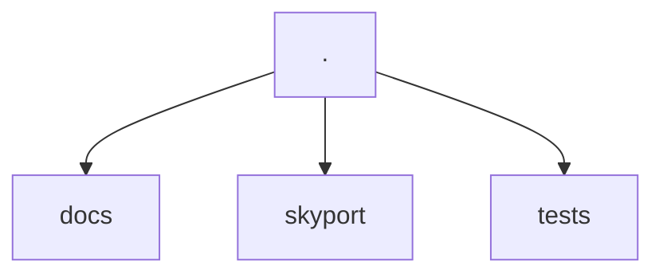
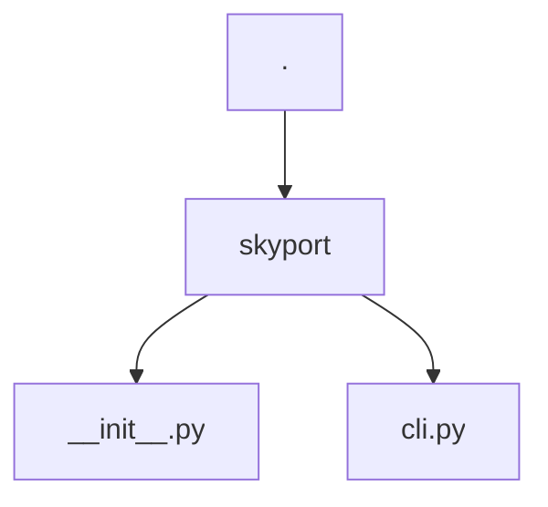
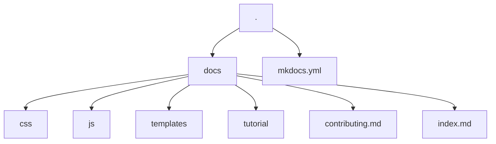

# Contributing

Thank you for being interested in contributing to Skyport :heart:! This document lists all the guidance you may need to contribute.

## How does the project work?

### Project structure



The project is divided into three directories. `docs`, `skyport` and `tests`. Where each directory has its specific function.

#### skyport



All CLI code is written in the cli.py file. The docstrings follow the [google docstring](https://sphinxcontrib-napoleon.readthedocs.io/en/latest/example_google.html) standard. So, if you change anything in the code, remember to also update the docstrings.

#### The CLI

The CLI was built using the [Typer](https://typer.tiangolo.com/) library, and you can check its documentation for more details if you want to expand the CLI's functionality.

For rich responses in the application output, the [Rich](https://rich.readthedocs.io/en/stable/introduction.html) library was used. If you want to change something in relation to the tables generated in the output, you can go directly to the [documentation page](https://rich.readthedocs.io/en/stable/tables.html) for the tables.

The only convention that is being followed regarding the CLI is that a rich `Console` object has already been defined and a `Typer` app. It would be interesting for you to continue using these objects

```{ .py .no-copy title="skyport/cli.py"}
import typer
from rich.console import Console

...

app = typer.Typer(
    help='Skyport is a CLI for obtaining information from astronomical objects.'
)
console = Console()
```

#### Tests

For testing we are using [pytest](https://docs.pytest.org/). Its settings can be found in the [pyproject.toml](https://github.com/henriquesebastiao/skyport/blob/main/pyproject.toml) file in the root of our project.

Test coverage is being generated automatically with [pytest-cov](https://github.com/pytest-dev/pytest-cov) and is displayed when the test task is executed:

<div class="termy">

```console
$ task test
```

</div>

Just like linters are requirements for these tests.

#### Documentation

The entire documentation is based on the use of [mkdocs](https://www.mkdocs.org/) with the [mkdocs-material](https://squidfunk.github.io/mkdocs-material/) theme.



All configuration can be found in the [mkdocs.yml](https://github.com/henriquesebastiao/skyport/blob/main/mkdocs.yml) file in the root of the repository.

Various devices are also being used to complement the documentation. Like [jinja](https://jinja.palletsprojects.com/en/3.1.x/) templates in places where instructions can be repeated. If you find blocks like:

```{ .txt .no-copy }
{ % % }
```

You will know that it is a template.

Templates are defined in the `/docs/templates` directory. In some cases, however, they may be called by variables with `command.run` which appears in almost all documentation files. These macros are being made with [mkdocs-macros](https://mkdocs-macros-plugin.readthedocs.io/en/latest/) and are defined in the mkdocs configuration file:

```{ .yaml .no-copy title="mkdocs.yml"}
extra:
  commands:
    run: skyport 
```

## Tools

This project basically uses two tools as a basis for everything with control:

- [Poetry](https://python-poetry.org/): For environment management and library installation;
- [Taskipy](https://github.com/illBeRoy/taskipy): For automation of routine tasks. How to run tests, linters, documentation, etc...

So, make sure you have poetry installed for this contribution:

<div class="termy">

```console
$ pipx install poetry
```

</div>

## Steps to perform specific tasks

Listed here are commands that you can use to perform common tasks. How to clone the repository, how to install the dependencies, run the tests, etc...

### How to clone the repository

<div class="termy">

```console
$ git clone https://github.com/henriquesebastiao/skyport.git
```

</div>

## How to install dependencies

<div class="termy">

```console
$ poetry install
```

</div>

## How to run the CLI

<div class="termy">

```console
$ task run [subcommand]
```

</div>

## How to run code check

<div class="termy">

```console
$ task lint
```

</div>

## How to run the tests

<div class="termy">

```console
$ task test
```

</div>


## Tasks for contribution

These are tasks that we know need to be done to add new functionality to the CLI.

Currently, the focus is on implementing all [public APIs made available by NASA](https://api.nasa.gov/), below is a list.

**To implement:**

- [ ] Asteroids NeoWs - Near Earth Object Web Service
- [ ] DONKI - Space Weather Database Of Notifications, Knowledge, Information
- [ ] Earth - Unlock the significant public investment in earth observation data
- [ ] EONET - The Earth Observatory Natural Event Tracker
- [ ] EPIC - Earth Polychromatic Imaging Camera
- [ ] Exoplanet - Programmatic access to NASA's Exoplanet Archive database
- [ ] Open Science Data Repository - Programmatic interface for the Open Science Data Repository website
- [ ] Insight - Mars Weather Service API
- [ ] Mars Rover Photos - Image data gathered by NASA's Curiosity, and Spirit rovers on Mars 
- [ ] NASA Image and Video Library - API to access the NASA Image and Video Library site at images.nasa.gov
- [ ] TechTransfers - Patents, Software, and Tech Transfer Reports
- [ ] Satellite Situation Center - System to cast geocentric spacecraft location information into a framework of (empirical) geophysical regions
- [ ] SSD/CNEOS - Solar System Dynamic and Center for Near-Earth Object Studies
- [ ] Techport - API to make NASA technology project data available in a machine-readable format
- [ ] TLE API - Two line element data for earth-orbiting objects at a given point in time
- [ ] Vesta/Moon/Mars Trek WMTS - A Web Map Tile Service for the Vesta, Moon, and Mars Trek imagery projects
- [ ] 

## I didn't find what I needed here

If you haven't found what you need, you can open an [issue in the project](https://github.com/henriquesebastiao/skyport/issues) reporting what you can't do or what needs to be better documented.

## Continuous improvement

This document can be improved by anyone interested in improving it. So, feel free to provide more tips to people who want to contribute as well :heart:.